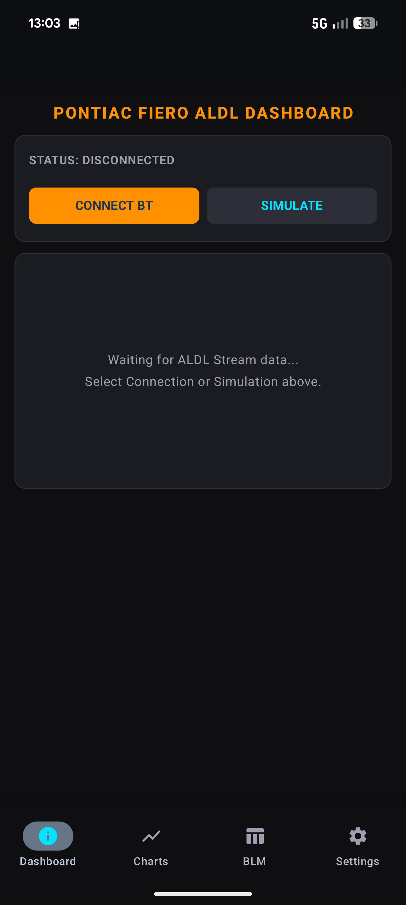
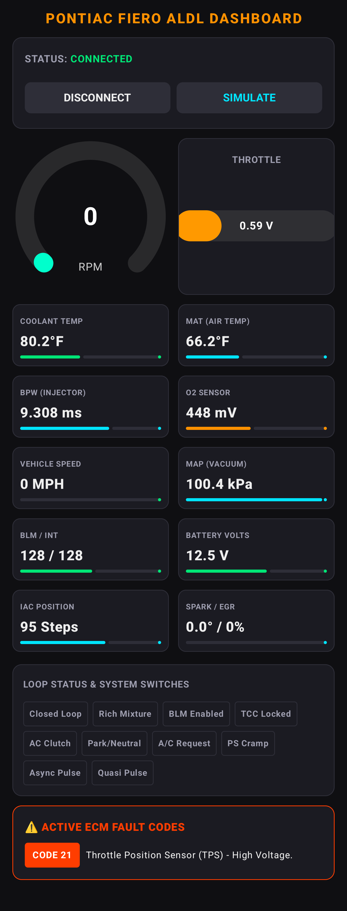
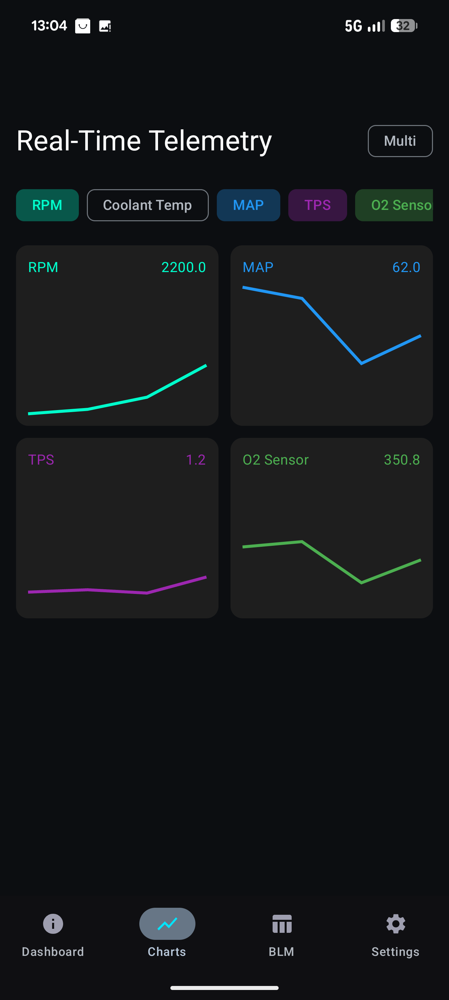
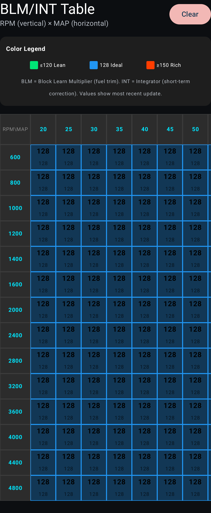
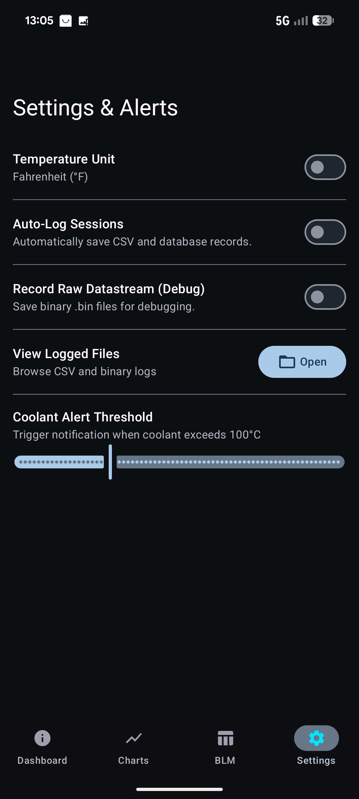

# ESP32 ALDL Dashboard Android Application

A modern, high-performance Android application designed to interface with GM OBD1 systems—specifically the **1986 Pontiac Fiero 1227170 ECM** —using a custom ESP32 Bluetooth SPP bridge. The app decodes the low-speed 160-baud ALDL (Assembly Line Diagnostic Link) datastream in real-time, displaying live telemetry, logging diagnostic parameters, and generating tuning heatmaps.

---

## 📸 Screenshots

The app features a clean, dark-themed interface optimized for in-car use. Below are the primary screens:

### 1. Main Dashboard (Disconnected / Initial State)


### 2. Live Instrumentation Dashboard (Connected)
Real-time gauges, sensor cards, status flags, and active ECM fault code alerts.


### 3. Real-Time Telemetry Charts (Multi-Parameter Mode)
Dynamic line charts supporting up to 4 simultaneous parameters with single/multi toggle.


### 4. BLM/INT Fuel Trim Heatmap Table
Color-coded 14×17 (RPM × MAP) diagnostic grid with live updates and legend.


### 5. Settings & Alerts
Persistent preferences, auto-logging controls, raw datastream recording, logged files browser, and threshold sliders.


---

## 🌟 Key Features

- **Real-Time Instrumentation Dashboard:** Vibrant, animated Canvas-based components including a radial RPM gauge and a Throttle Position Sensor (TPS) bar graph.
  * Instantaneous readouts for Engine Speed (RPM), Vehicle Speed (MPH), Coolant Temperature, Manifold Air Temp (MAT), Manifold Absolute Pressure (MAP), TPS voltage, O2 Sensor voltage, and Battery voltage.
  * **Status Flags:** Instant visibility into critical operating states like Closed Loop Mode, Rich/Lean Mixture, Torque Converter Clutch (TCC) Lockup, and A/C Clutch requests.
  * **Derived Metrics:** Real-time calculated estimates of Engine Load and Fuel Flow Hints.
- **BLM & INT Fuel Trim Heatmap Grid (New):** A real-time diagnostic table indexing fuel trim metrics across **14 RPM bands** (600 to 4800 RPM) and **17 MAP bands** (20 to 100 kPa).
  * Color-coded cell visualisations using dynamic RGB interpolation: Green for lean fuel trims (≤ 120), Blue for stoichiometric neutral (128), and Red for rich fuel trims (≥ 150).
- **Multi-Parameter Line Charting (New):** A dynamic telemetry visualizer toggling between a **Single Chart Mode** (large-scale view of any metric) and a **Multi Chart Mode** displaying up to 4 selected metrics in a 2x2 grid.
  * Supports charting for **12 distinct parameters**: RPM, Coolant Temp, MAP, TPS, O2 Sensor, Battery Voltage, Spark Advance, Base Pulse Width (BPW), MAT, BLM, Integrator, and Idle Air Control (IAC) Position.
- **Trouble Code Diagnostic Engine:** Decodes active ECM trouble codes into human-readable alerts (e.g., *Code 14 - Coolant Temperature Sensor High*) dynamically displayed at the bottom of the dashboard screen.
- **Dual-Logging Framework:**
  * **Room Database Sessions:** Saves all active telemetry packets to a local SQLite database using Jetpack Room.
  * **TunerPro RT CSV Export:** Automatically compiles sessions into .csv log files fully compatible with TunerPro RT, exported to Downloads/ALDLLogs using Android MediaStore.
  * **Raw Binary Stream Logging (New):** Optional raw capture recording direct 27-byte diagnostic datastream packets (incorporating AA 55 headers and 25-byte payloads) to .bin files for advanced playback and diagnostic troubleshooting.
- **Logged Files Manager (New):** An in-app browser inside the Settings panel that scans Downloads/ALDLLogs for CSV and BIN logs, enabling users to view details, open logs with default viewers, or share files via the Android Sharesheet.
- **Persistent Preferences & Guardrails:** DataStore-backed settings for Temperature Unit toggle (°C/°F), Auto-Logging toggles, Coolant alert thresholds, Low Battery alert thresholds, and Raw Binary Stream recording toggles.

---

## 🛠️ Architecture & Technical Highlights

- **Jetpack Compose & MVVM:** Developed with a clean Model-View-ViewModel architecture. State emission is managed via reactive StateFlow and SharedFlow streams to guarantee lag-free rendering.
- **Circular Buffering & Packet Validation (New):** Ingests raw Bluetooth stream buffers using an ArrayDeque<Byte> circular buffer.
  * Employs a **27-byte lookahead validation algorithm** to search for authentic AA 55 frame headers, preventing sync misalignment or telemetry corruption from noisy serial lines.
- **TunerPro ADS Translation:** Uses an advanced ALDLParser mapping raw 25-byte payloads into physical metrics using exact scale conversions, offsets, and non-linear lookup interpolations (derived from the 24-INT10.ads definition file).
- **Foreground Service Operations (New):** Runs a persistent BluetoothForegroundService to keep the Bluetooth socket open and stream telemetry continuously in the background, even when the phone screen is locked or the app is minimized.

---

## 📱 Requirements

- **Android Device:** Android 8.0 (API Level 26) or higher.
- Requires Nearby Devices (Android 12+) and Legacy Bluetooth Admin access.
- **ESP32 Transceiver:** Bridge hardware programmed to output 160-baud serial data from the ALDL pin and stream it over Classic Bluetooth SPP (named `ESP32-ALDL`).

---

## 🚀 Setup & Usage

1. Pair the ESP32-ALDL Bluetooth module in your Android system settings.
2. Launch the application and grant all requested permissions.
3. Tap **Connect BT** on the main dashboard to establish connection and start telemetry.
4. Navigate between screens (Dashboard, Charts, BLM Table, Settings) using the bottom navigation bar.
5. Configure logging preferences or browse logged CSV/BIN files in the **Settings** menu.

---

## 🧪 Testing & Verification

The parsing logic, scaling calculations, and boundary conditions are validated by a unit test suite located in [ALDLParserTest.kt](app/src/test/java/com/gronod/esp32aldldashboard/ALDLParserTest.kt).

To run the unit tests, execute the following Gradle command in the root project directory:

```bash
./gradlew test
```

### Coverage Areas

- **Sample Frame Decoding:** Parses a real-world telemetry payload and verifies the output of IAC position, coolant/manifold temperatures, MAP, TPS, battery voltage, BLM, integrator, spark advance, base pulse width, closed-loop flags, and active trouble codes.
- **Boundary Guards:** Ensures outlier protection for engine speeds, battery voltages, TPS, and coolant temperatures, rejecting out-of-range sensor values as invalid data packets.
- **Lookahead Stability:** Validates parser behavior against truncated or incomplete frame fragments.

---

## 📄 License & Privacy

- [LICENSE](LICENSE) (MIT)
- [PRIVACY.md](PRIVACY.md)
